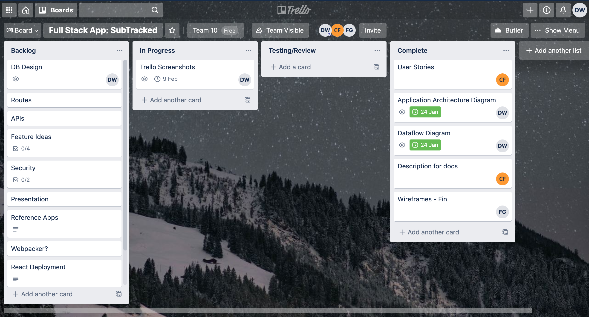

# SubTracked-T3A2-A

## Description:

 

***What is SubTracked?***

- Purpose

    - The SubTracked application is a subscription management platform, allowing users to roll all of their subscriptions together into one easy web application. This allows users to manage their subscriptions with ease, removing the stress of not knowing when payments are due.

 

- Functionality and Features

   - SubTracked features:
     - an intuitive design inspired by a 'less is more' approach, making it is easy to navigate and manage subscriptions
     - alerts to notify users when they have upcoming payments, including cost and due date
     - a flexible creation system allowing for any subscription to be tracked and managed by users

 

- Target Audience

   - SubTracked is designed for anyone who wants to keep up to date with their subscriptions and take control of their subscription costs

 

- Tech Stack

    - SubTracked features a diverse tech stack, including:

       - Ruby on Rails

       - JavaScript

       - React

       - HTML5

       - CSS3

       - PostgreSQL Database

 

## Dataflow Diagram:

 

 

## Application Architecture Diagram:

 

 

 

## User Stories:

 

***As a user, I want to:***

- be able to keep track of my paid subscriptions in order to budget and keep on top of my finances

- be able to create and edit my own subscriptions, including the billing frequency and amount

- be able to delete subscriptions after I've unsubscribed from them

- be alerted when a subscription is due and how much it will cost

- be able to navigate the application easily via a simple and intuitive interface

 

## Wireframes:

 

<a href="./docs/img/diagrams/subtracked-wireframes.pdf">SubTracked Wireframes (PDF)</a>

 

## Trello:

 

    

    Trello Screenshots (Click to expand):
    

    - Day 1:
    
    - Day 2:
    
    - Day 3:
    
    - Day 5:
    
    - Day 6:
    
    - Day 7:
    
    - Day 8:
    

 
