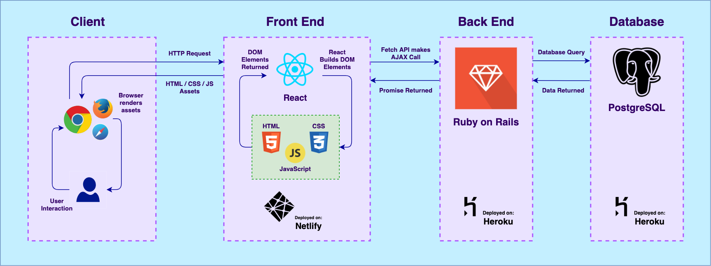

# SubTracked-T3A2-A

## Description:

 

***What is SubTracked?***

- Purpose

    - SubTracked's purpose it to take the multiple subscriptions people pick up and roll them together into one easy web         application. This allows for people to maintain their subscriptions with relative ease, and takes the stress away from not knowing when payments are due
 

- Functionality and Features

   - SubTracked features an easy-to-use layout and takes advantage of the less is more approach. SubTracked is easy to navigate, and makes managing subscriptions easy

   - SubTracked alerts the user when they have an upcoming payment, and notifies them of the cost and the due date

   - SubTracked also features the ability to plug any subscription you want into the system, also allowing for full editing and deletion of subscriptions
 

- Target Audience

   - SubTracked's demographic is quite broad, and aims to serve anyone who wants to be up to date with their subscriptions and finances
 

- Tech Stack

    - SubTracked features a diverse tech stack, including:

       - Ruby on Rails

       - JavaScript

       - React

       - HTML5

       - CSS

       - PostgreSQL database

 

## Dataflow Diagram:

 

 

## Application Architecture Diagram:

 

 

 

## User Stories:

 

***As a user, I want to:***

- I want to be able to keep track of my paid subscriptions, in order to be able to budget and keep on top of my finances

- I want to be alerted in advance to when a subscription is due, and how much the subscription is due for

- I want to be able to seamlessly traverse the app, and be able to cognitively work the site without trouble

- I want to be able to easily set my own subscriptions, and be able to know exactly when and for how much my subscription is going to cost

- I want to be able to update my subscriptions, in order to change the cost of them

- I want to be able to delete subscriptions, after I've unsubscribed from them

 

## Wireframes:

 

    

    Wireframes (Click to expand):
    

    - Example:
    

 

## Trello:

 

    

    Trello Screenshots (Click to expand):
    

    - Day 1:
    
    - Day 2:
    
    - Day 3:
    
    - Day 4:
    

 
